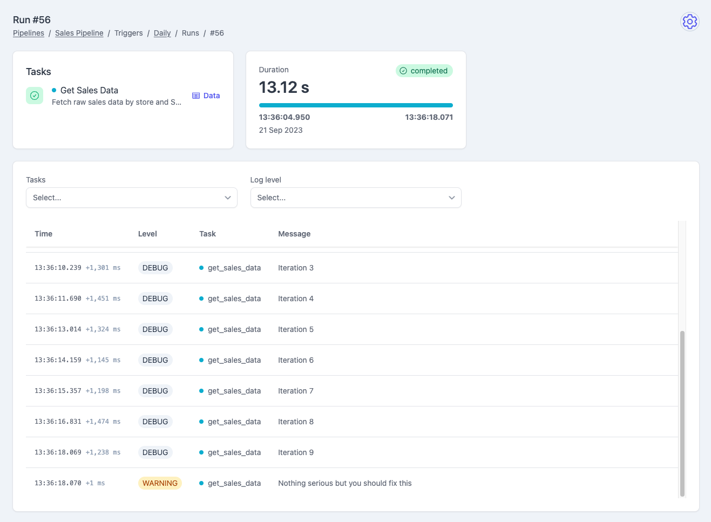

A task is just a regular Python function decorated with the `task` decorator,
the functions can be also `async`, Plombery will take care of everything:

```py
@task
def sync_task():
  pass

@task
async def async_task():
  pass
```

## Input parameters

If the pipeline declares input parameters:

```py
class InputParams(BaseModel):
  some_value: int

register_pipeline(
  # ...
  params=InputParams
)
```

then the task function will receive those input parameters
via the `params` argument:

```py
@task
async def my_task(params: InputParams):
  result = params.some_value + 8
```

## Output data

In Plombery, pipelines execute their tasks sequentially and the return value of a task
is considered its output data that is passed to the next ones as positional arguments:

```py
@task
def task_1():
  return 1

@task
def task_2(from_1):
  # from_1 = 1
  return from_1 + 1

@task
def task_3(from_1, from_2):
  # from_1 = 1
  # from_2 = 2
  return from_1 + from_2
```

## Logging

Plombery collects automatically pipelines logs and shows them on the UI:

<figure markdown>
  
  <figcaption>Pipeline run logs</figcaption>
</figure>

To use this feature, you need to use a plombery's logger simply calling
the `get_logger` function:

```py
from plombery import get_logger

@task
def my_task():
  logger = get_logger()
  logger.debug("Hey greetings!")
```

!!! warning

    `get_logger` is a special function that only works inside tasks functions:
    don't call it outside of those functions as it won't work!
    ```py
    # ❌ Don't do this
    logger = get_logger()
    def my_task():
      logger.debug("Hey greetings!")
    ```
